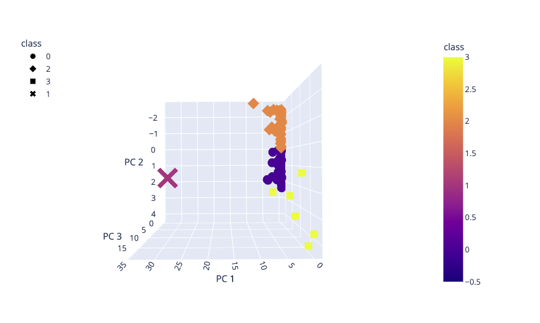
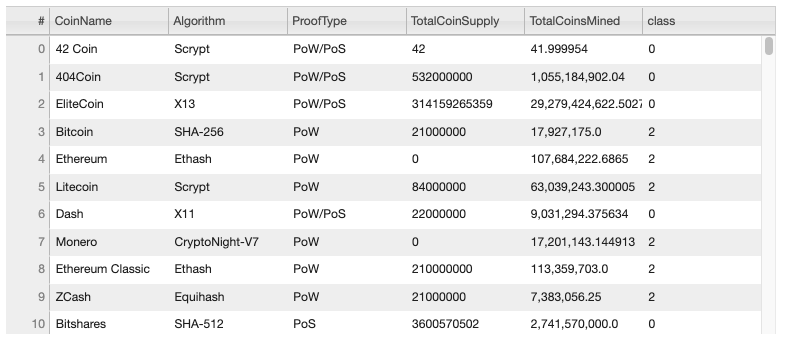
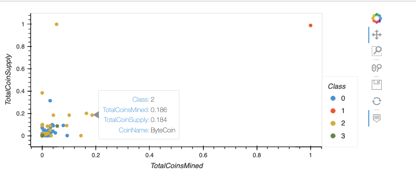

# Cryptocurrencies

First for this challenge we will preprocess the dataset in order to perform PCA using our knowlege of Pandas.
Then in Deliverable 2 using the knowledge of how to apply the Principal Component Analysis (PCA) algorithm, we’ll reduce the dimensions of the X DataFrame to three principal components and place these dimensions in a new DataFrame.
And after that using K-means algorithm, we’ll create an elbow curve using hvPlot to find the best value for K from the pcs_df DataFrame created in Deliverable 2. Then, we’ll run the K-means algorithm to predict the K clusters for the cryptocurrencies’ data.
Finaly, we'll create scatter plots with Plotly Express and hvplot, visualize the distinct groups that correspond to the three principal components we created in Deliverable 2, then create a table with all the currently tradable cryptocurrencies using the hvplot.table() function.

For visualization point we created 3D scatter plot using the Plotly Express scatter_3d() function to plot the three clusters from the clustered_df DataFrame and it looks like following:

Then create a table with tradable cryptocurrencies using the hvplot.table() function, it looks like the following image:

And finaly, create an hvplot scatter plot with x="TotalCoinsMined", y="TotalCoinSupply", and by="Class", and have it show the CoinName when you hover over the the data point. See the image below:

